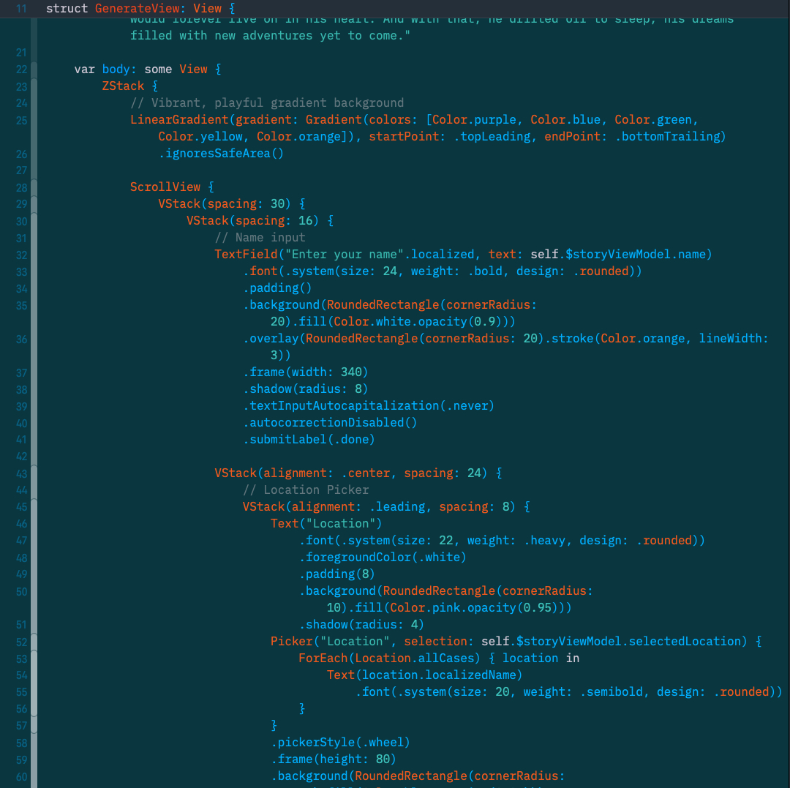
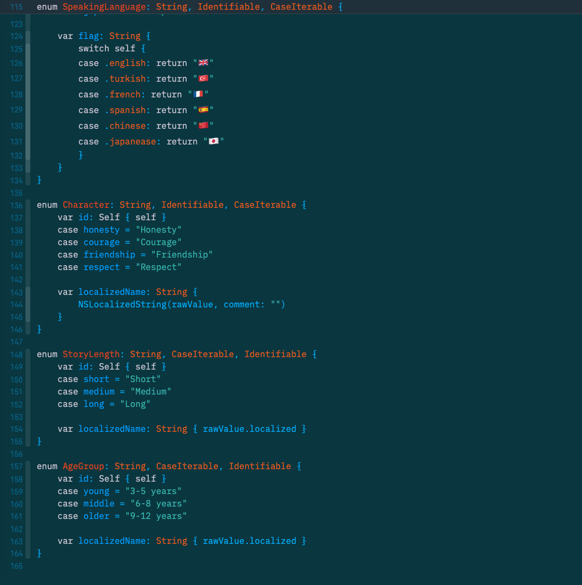

# 🌙 XCode Solarized Dark Theme

A beautiful and eye-friendly Solarized Dark color scheme for XCode that reduces eye strain during long coding sessions.

## ✨ Features

- **Solarized Dark Color Palette**: Based on the popular Solarized color scheme
- **Optimized for XCode**: Carefully crafted for the best development experience
- **Easy Installation**: Simple drag-and-drop installation process
- **Professional Look**: Clean, modern appearance that enhances code readability

## 🖼️ Screenshots

### Main Editor View

### Code Detail View

## 🚀 Installation

### Method 1: Drag & Drop (Recommended)

1. **Download the theme file**: `Solarize Dark.xccolortheme`
2. **Open XCode**
3. **Navigate to**: `XCode → Preferences → Fonts & Colors`
4. **Drag and drop** the `Solarize Dark.xccolortheme` file into the themes list
5. **Select** "Solarize Dark" from the theme dropdown
6. **Enjoy** your new coding environment! 🎉

### Method 2: Manual Installation

1. **Copy** the `Solarize Dark.xccolortheme` file
2. **Navigate to**: `~/Library/Developer/Xcode/UserData/FontAndColorThemes/`
3. **Paste** the theme file into this directory
4. **Restart XCode**
5. **Select** the theme from Preferences

## 🎨 Color Scheme

This theme features the classic Solarized Dark palette:
- **Background**: Deep blue-gray for reduced eye strain
- **Foreground**: Light gray for excellent contrast
- **Syntax Highlighting**: Carefully chosen colors for optimal readability
- **Comments**: Muted green for subtle but clear distinction

## 📱 Compatibility

- **XCode 16+** (tested and optimized)
- **macOS 26.00+**
XCode

## 🤝 Contributing

Found a bug or have a suggestion? Feel free to:
- Open an issue
- Submit a pull request
- Share your feedback

## 📄 License

This theme is open source and available under the MIT License.

## ⭐ Show Your Support

If you find this theme helpful, please consider:
- ⭐ Starring this repository
- 🍕 Buying me a coffee (if you're feeling generous)
- 📢 Sharing with your developer friends

---

**Happy Coding!** 💻✨

*Made with ❤️ for the XCode community* 